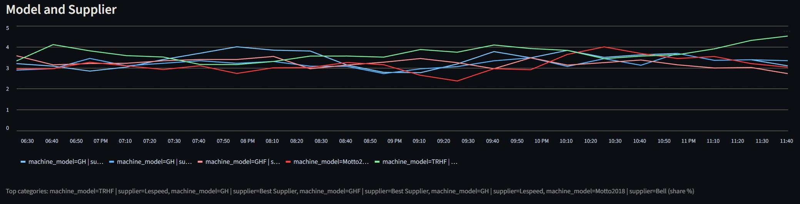

# DE Pipeline – Synthetic Device Telemetry

This repo simulates a tiny fleet of ATMs/CC/PD/PC devices, exposes their stats through a FastAPI endpoint, ingests each batch into files + SQLite, and keeps an eye on uptime with a small SRE toolkit. It’s meant to feel realistic enough for data-engineering dry runs without needing any external systems.

## Tools used
- **Python 3.11** (via Micromamba/Conda env)
- **FastAPI + Uvicorn** for the synthetic API
- **Requests** for ingestion calls
- **SQLite** for time-series storage
- **Pandas** for transformations and analytics
- **Streamlit** for the dashboard
- **Airflow** to orchestrate the ingest DAG
- **Git** for version control



## Highlights
- **Synthetic dataset** with thousands of devices and realistic metadata.
- **Fake REST API** (`api/fake_api.py`) that lets you request rolling windows of activity.
- **Collector** that stores every payload as JSON, CSV, and time-series rows in SQLite.
- **SRE add-ons**: automatic online-percentage monitor + alert log, plus a Streamlit dashboard that can compare multiple segments at once.
- **Airflow DAG** to schedule ingestion runs every minute (with optional accelerated clocks for demos).

## Repo tour
| Path | What it does |
| --- | --- |
| `data_raw/generate_synthetic_data.py` | Creates the base `synthetic_devices.csv`. |
| `api/fake_api.py` | FastAPI app that loads the devices, updates timestamps, and emits aggregated segments. |
| `data_collection/fake_api_collector.py` | Calls the API, saves JSON/CSV snapshots, persists rows to SQLite, and runs the SRE monitor. |
| `data_collection/store_timeseries.py` | Shared helper that upserts flattened rows into `segment_timeseries.db`. |
| `sre_analysis/online_monitor.py` | CLI + library that computes the last-hour online share and triggers alerts when it drops too much. |
| `sre_analysis/dashboard.py` | Streamlit dashboard to explore the online KPI and compare multiple segments/dimensions. |
| `airflow/dags/segment_stats_dag.py` | An example DAG that wires everything together. |

## Data dictionary

- `device_code` – unique ID built from the machine type prefix (`AT`, `CC`, `PD`, `PC`) plus a six-digit sequence.
- `acquisition_sequence` – branch identifier glued to the acquisition date (YYYYMMDD), e.g., `12345` + `20230615`.
- `branch_id` – five-digit branch code where the device belongs.
- `state` – Brazilian state (two-letter code) that hosts the device.
- `has_error` – boolean flag (`True`/`False`) that signals whether the device is in trouble.
- `machine_type` – top-level category: ATM, CC, PD, or PC.
- `machine_model` – specific model within the type (ATMv18, Bell2021, etc.).
- `supplier` – vendor/manufacturer string.
- `network_address` – private IPv4 address assigned to the box.
- `operating_system` – OS family (Ubuntu, Windows).
- `os_version` – version string with one decimal place.
- `acquisition_date` – when the device entered the fleet (`YYYY-MM-DD`).
- `last_connection_ts` – last telemetry timestamp captured for that device (`YYYY-MM-DD HH:MM:SS` in UTC).

Segments produced by the API reuse the same raw fields in the `dim*_name`/`dim*_value` pairs. For example:
- `segment="State"` → `dim1_name="state"`, `dim1_value="SP"`.
- `segment="Type and OS and OS_version"` → dims contain `machine_type`, `operating_system`, `os_version`.

## Getting started
1. **Clone & install dependencies**
   ```bash
   git clone <repo>
   cd DE_pipeline
   micromamba create -f environment.yml
   micromamba activate DE_pipeline   # or conda
   ```

2. **Generate synthetic devices (once)**
   ```bash
   python data_raw/generate_synthetic_data.py -n 4000
   ```

3. **Run the API locally**
   ```bash
   uvicorn api.fake_api:app --reload
   ```
   Endpoint: `POST /segment-stats` (accepts `current_time`, `window_minutes`, `frequency_minutes`, `update_probability`).

## Collecting data
Manual, single run:
```bash
python -m data_collection.fake_api_collector --api-url http://127.0.0.1:8000/segment-stats
```

Accelerated clock (simulate time jumps without waiting an hour):
```bash
python -m data_collection.fake_api_collector --simulate-minutes 15
```

Key flags:
- `--current-time` to force a timestamp (UTC format).
- `--output-dir` to place JSON/CSV elsewhere.
- `--timeseries-db` (defaults to `data_collection/segment_timeseries.db`).

Each run:
1. Stores the raw JSON under `data_collection/json/`.
2. Writes a flattened CSV under `data_collection/csv/`.
3. Upserts every row into the SQLite table `segment_timeseries`.
4. Invokes the SRE monitor so alerts show up immediately.

## SRE goodies
### Online monitor CLI
Run it whenever you want a status check:
```bash
python -m sre_analysis.online_monitor --db-path data_collection/segment_timeseries.db
```

What it does:
- Sums the `Type` segment rows per timestamp to find “machines online”.
- Divides by the total device inventory (from `data_raw/synthetic_devices.csv`).
- Compares the latest percentage to the rolling baseline of the previous `history` snapshots (defaults to 4).
- Logs alerts to `sre_analysis/alerts.log` when the drop fraction passes the threshold (default 15%).

If something goes wrong (missing DB, incompatible schema, etc.), it prints a friendly warning but doesn’t crash the ingestion.

## Dashboard
Launch:
```bash
streamlit run sre_analysis/dashboard.py
```

Features at a glance:
- Latest online percentage vs. rolling baseline and drop fraction.
- Alert summaries when the drop threshold is breached.
- **Segment breakouts**: select multiple segments (State, Type, Supplier, combos, etc.) and overlay the top dimension values over time.
- Toggle between percentage share and raw counts, choose how many dimension values to plot, and use the sidebar to tweak paths/history thresholds.


## Scheduling with Airflow
- DAG: `airflow/dags/segment_stats_dag.py`.
- Schedule: every minute (`* * * * *`).
- It simply imports and calls `run_ingestion` with the env-configured API URL, output dir, and (optionally) simulated clock settings.
- Useful env vars:
  - `SEGMENT_STATS_API_URL`
  - `SEGMENT_STATS_SIM_MINUTES`
  - `SEGMENT_STATS_SIM_STATE_FILE`

Drop the DAG into an Airflow instance, set up a Python environment that can reach this repo, and you get continuous synthetic telemetry.

## Data model quick reference
`segment_timeseries` columns:
```
ts TEXT
segment TEXT
count INTEGER
dim1_name TEXT
dim1_value TEXT
dim2_name TEXT
dim2_value TEXT
dim3_name TEXT
dim3_value TEXT
PRIMARY KEY (ts, segment, dim1_name, dim1_value, dim2_name, dim2_value, dim3_name, dim3_value)
```
The flattened CSV files have the same headers, so you can re-import them easily.

## Troubleshooting
- **ModuleNotFoundError: common** – run collectors via `python -m data_collection.fake_api_collector` (note the `-m`) from the repo root so packages resolve correctly.
- **Pandas/Numpy binary mismatch** – if you see `numpy.dtype size changed`, make sure pandas matches the installed NumPy (the `environment.yml` already pins compatible versions).
- **Empty graphs** – run the collector at least once so the SQLite DB has snapshots. The dashboard warns you if the tables are empty.

## Contributing / ideas
- Wire the SRE alerts into real notification channels (Slack, email, etc.).
- Extend the dashboard with anomaly scoring or a heatmap of states.
- Use the same SQLite DB as an Airflow or dbt source for analytics practice.

Have fun poking at it, and don’t hesitate to tweak things—the whole point is to experiment without breaking anything in production.

